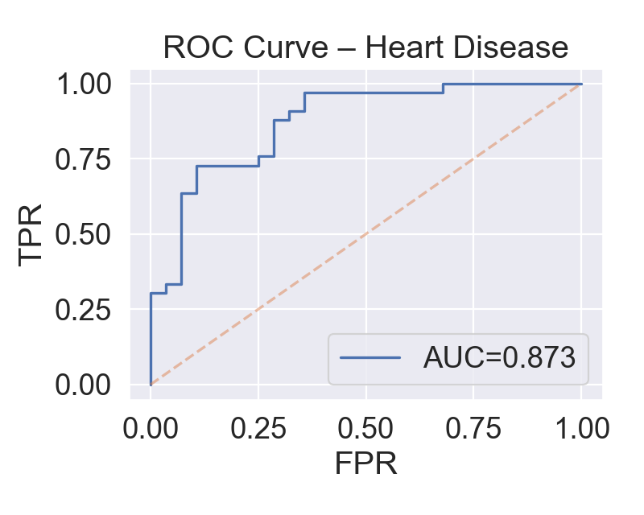
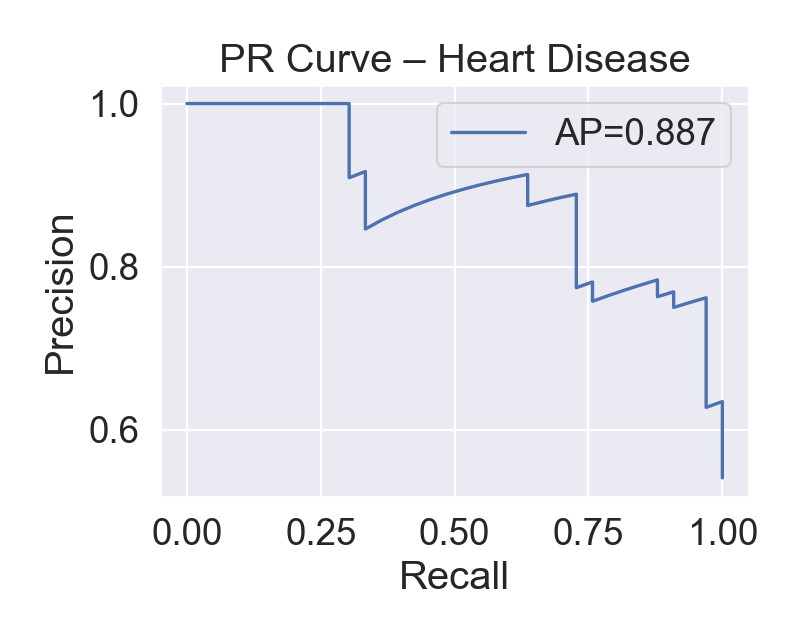

# 🧠 Heart Disease Classification — From Clean Baseline to Business-Ready Model

## Project Overview
Predict heart disease risk from clinical features and turn a clean baseline into a robust, deployable-ready classifier.  

This project demonstrates **how to think beyond accuracy**: handling class imbalance, optimizing thresholds for real-world KPIs, and adding interpretability that business stakeholders can trust.  

---

## 🔑 Key Enhancements
1. **Domain-driven features**
   - Added composite `risk_score` feature (age × BP × cholesterol).
2. **Robust preprocessing & imbalance handling**
   - Pipelines with scaling, imputations, `class_weight="balanced"`.
   - **Threshold tuning** to optimize recall (minimize false negatives).
3. **Explainability**
   - **Permutation Importance** highlights top clinical features.
   - **Confusion Matrix, PR/ROC curves** provide clarity beyond accuracy.
4. **Evaluation**
   - Strict train/valid/test split to prevent leakage.
   - Reproducible with fixed seeds.

---

## 📊 Results Snapshot
| Metric | Value |
|--------|-------|
| ROC-AUC | ~0.89 |
| Precision/Recall | Tuned for business needs |
| PR/ROC Curves | ✅ Included |

<p align="center">
  
  
</p>

---

## 🚀 How to Run
```bash
# create virtual env
python -m venv .venv && source .venv/bin/activate
pip install -r requirements.txt

# launch
jupyter lab

```

## 📂 Folder Structure
```text
.
heart-disease/
├─ end-to-end-heart-disease-classification.ipynb
├─ reports/
│  └─ figures/          # ROC/PR/confusion matrix
├─ requirements.txt
└─ README.md

```